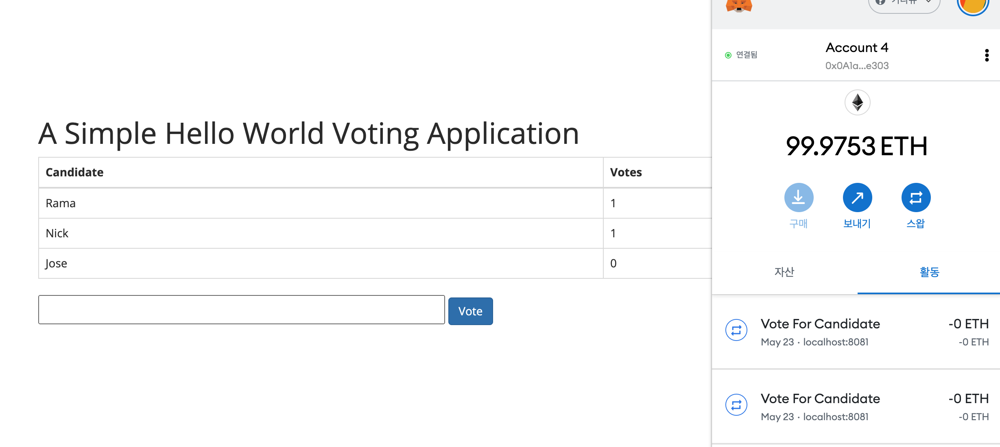
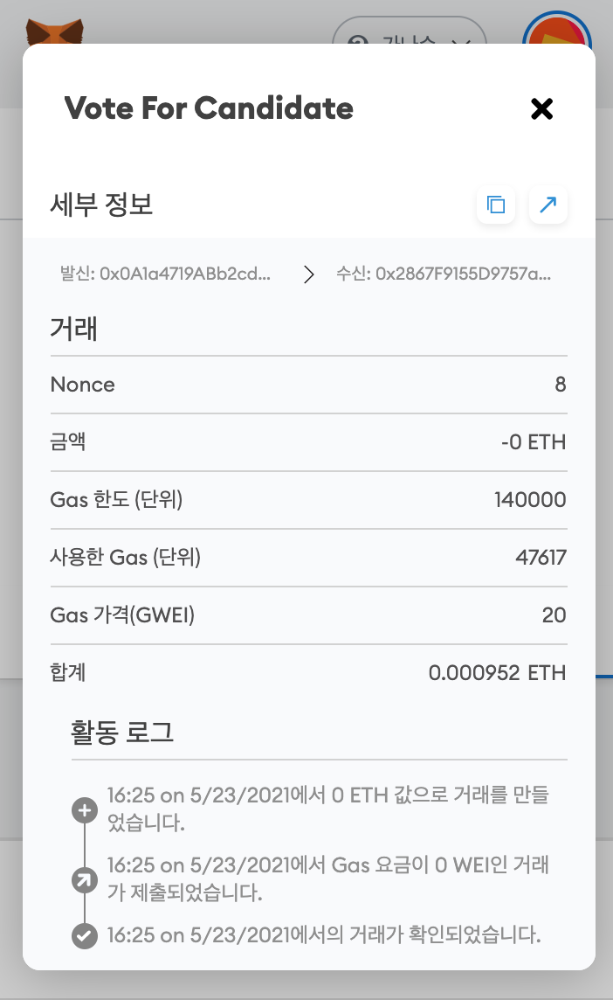

## 💻 항공대 블록체인 과목 DAPP 투표 시스템 실습

### 1. 실행환경 세팅

```
npm i
```

### 2. truffle 전역 설치

```
npm i -g truffle
```

### 3. 웹팩 서버 실행

```
npm run dev
```

### 2. 실행 결과



메타마스크와 연동해 트랜잭션을 확인하는 모습

- 투표할 때마다 트랜잭션과 가스가 청구됨.



트랜잭션 세부 내용 확인 결과
